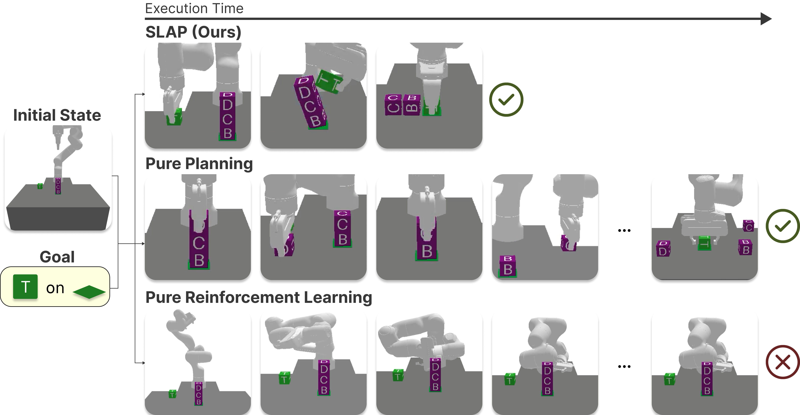
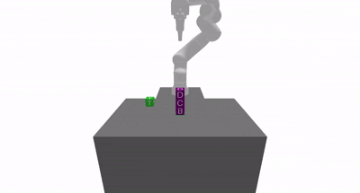
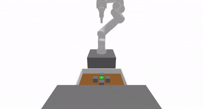
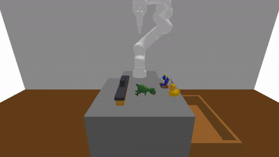

# SLAP: Shortcut Learning for Abstract Planning

Y. Isabel Liu, Bowen Li, Benjamin Eysenbach, and Tom Silver



## Abstract
Long-horizon decision-making with sparse rewards and continuous states and actions remains a fundamental challenge in AI and robotics. Task and motion planning (TAMP) is a model-based framework that addresses this challenge by planning hierarchically with abstract actions (options). These options are manually defined, limiting the agent to behaviors that we as human engineers know how to program (pick, place, move). In this work, we propose Shortcut Learning for Abstract Planning (SLAP), a method that leverages existing TAMP options to automatically discover new ones. Our key idea is to use model-free reinforcement learning (RL) to learn **shortcuts** in the abstract planning graph induced by the existing options in TAMP. Without any additional assumptions or inputs, shortcut learning leads to shorter solutions than pure planning, and higher task success rates than flat and hierarchical RL. Qualitatively, SLAP discovers dynamic physical improvisations (e.g., slap, wiggle, wipe) that differ significantly from the manually-defined ones. In experiments in four simulated robotic environments, we show that SLAP solves and generalizes to a wide range of tasks, reducing overall plan lengths by over $50\%$ and consistently outperforming planning and RL baselines. 

### Demo Videos

Watch SLAP in action across different PyBullet manipulation domains:

| Environment | Demo | Task Description |
|--------------|------|------------------|
| **Obstacle Tower** |  | Place target block in the obstructed target area |
| **Cluttered Drawer** |  | Retrieve target object from a cluttered drawer |
| **Cleanup Table** |  | Collect and place messy toys in the bin |

## Installation

**Setup:**

```bash
# 1. Clone the repository
git clone https://github.com/isabelliu0/SLAP.git
cd SLAP

# 2. Create and activate a conda environment (recommended)
conda create --name slap_env python=3.11
conda activate slap_env

# 3. Install SLAP
pip install -e ".[develop]"
```

**Unit tests:**

Double check that your installation passes the CI checks by running 
```bash
./run_ci_checks.sh
```
or
```bash
./run_autoformat.sh
mypy .
pytest . --pylint -m pylint --pylint-rcfile=.pylintrc
pytest tests/
```

## Pre-trained Policy Checkpoints

We provide minimal sets of pre-trained SLAP shortcut policies to reproduce the results shown in our paper and videos.

### Download Checkpoints

You can browse and download pre-trained policies directly below:

* **Obstacle Tower**: [Browse & Download](http://slap-data.s3-website.us-east-2.amazonaws.com/#trained_policies/multi_rl/GraphObstacleTowerTAMPSystem_MultiRL/)
* **Cluttered Drawer**: [Browse & Download](http://slap-data.s3-website.us-east-2.amazonaws.com/#trained_policies/multi_rl/ClutteredDrawerTAMPSystem_MultiRL/)
* **Cleanup Table**: [Browse & Download](http://slap-data.s3-website.us-east-2.amazonaws.com/#trained_policies/multi_rl/CleanupTableTAMPSystem_MultiRL/)

### Evaluate Pre-trained SLAP Shortcut Policies

```bash
# Obstacle Tower environment
python -m experiments.slap_eval --env obstacle_tower --seed 42

# Cluttered Drawer environment
python -m experiments.slap_eval --env cluttered_drawer --seed 42

# Cleanup Table environment
python -m experiments.slap_eval --env cleanup_table --seed 42
```

### Train with Pre-collected Data

We provide example sets of shortcut data for you to train SLAP policies directly.

### Download Training Data

Training data is organized by environment and contains graph-based shortcuts:

* **Obstacle Tower**: [Browse & Download](http://slap-data.s3-website.us-east-2.amazonaws.com/#training_data/multi_rl/GraphObstacleTowerTAMPSystem_MultiRL/)
* **Cluttered Drawer**: [Browse & Download](http://slap-data.s3-website.us-east-2.amazonaws.com/#training_data/multi_rl/ClutteredDrawerTAMPSystem_MultiRL/)
* **Cleanup Table**: [Browse & Download](http://slap-data.s3-website.us-east-2.amazonaws.com/#training_data/multi_rl/CleanupTableTAMPSystem_MultiRL/)

### Training Data Structure

```
training_data/
├── GraphObstacleTowerTAMPSystem/
│   ├── config.json                 # Training configuration
│   ├── states.pkl                  # State observations
│   ├── current_atoms.pkl           # Source abstract states
│   ├── goal_atoms.pkl              # Target abstract states
│   └── trained_signatures.pkl      # Cached shortcut signatures
├── ClutteredDrawerTAMPSystem/
│   └── ...
└── Obstacle2DTAMPSystem/
    └── ...
```

### Train SLAP Shortcut Policies

```bash
python -m experiments.slap_train --env obstacle2d --seed 42

python -m experiments.slap_train --env obstacle_tower --seed 42

python -m experiments.slap_train --env cluttered_drawer --seed 42

python -m experiments.slap_train --env cleanup_table --seed 42
```

### Collect Your Own Training Data

To collect fresh training data, you can remove the existing training data directory or set `force_collect=True`, and then run the same training files.

## Using SLAP on Your Own Environments

SLAP is designed to be a **plug-and-play** module with your custom TAMP environments. Follow the steps below to integrate SLAP with your domain. This is also how we adapted our PyBullet domains imported from [pybullet-blocks](https://github.com/tomsilver/pybullet-blocks) repo for our experiments.

### Step 1: Core Environment Utilities

Your environment must implement the following utilities to enable SLAP integration:

#### 1.1 Create a TAMP System Class

Create a system class that inherits from `ImprovisationalTAMPSystem`:

```python
# src/tamp_improv/benchmarks/my_custom_env.py

from tamp_improv.benchmarks.base import (
    BaseTAMPSystem,
    ImprovisationalTAMPSystem,
    PlanningComponents,
)
from tamp_improv.benchmarks.wrappers import ImprovWrapper

class MyCustomTAMPSystem(BaseTAMPSystem[ObsType, ActType]):
    """Your custom TAMP system."""

    def __init__(
        self,
        planning_components: PlanningComponents[ObsType],
        seed: int | None = None,
        render_mode: str | None = None,
    ):
        super().__init__(
            planning_components,
            name="MyCustomTAMPSystem",
            seed=seed
        )
        self._render_mode = render_mode

    def _create_env(self) -> gym.Env:
        """Create your base environment."""
        return YourGymEnvironment(render_mode=self._render_mode)

    def _get_domain_name(self) -> str:
        return "my-custom-domain"

    def get_domain(self) -> PDDLDomain:
        """Return PDDL domain definition."""
        return PDDLDomain(
            self._get_domain_name(),
            self.components.operators,
            self.components.predicate_container.as_set(),
            self.components.types,
        )

    @classmethod
    def create_default(
        cls,
        seed: int | None = None,
        render_mode: str | None = None,
    ) -> "MyCustomTAMPSystem":
        """Factory method with default PDDL components."""
        components = PlanningComponents(
            perceiver=YourPerceiver(),
            operators=YOUR_OPERATORS,      # LiftedOperator list
            types=YOUR_TYPES,               # Type set
            predicate_container=YourPredicateContainer(),
        )
        return cls(components, seed=seed, render_mode=render_mode)


# Wrap for improvisational policies
class MyCustomImprovisationalSystem(
    ImprovisationalTAMPSystem[ObsType, ActType]
):
    """Wrapper that adds SLAP-compatible functionality."""

    def _create_wrapped_env(self) -> gym.Env:
        return ImprovWrapper(
            self.env,
            self.perceiver,
            max_episode_steps=self.config.get("max_steps", 500),
            action_scale=self.config.get("action_scale", 1.0),
        )
```

#### 1.2 Implement Required Methods

Your environment **must** provide:

```python
class YourGymEnvironment(gym.Env):
    """Your Gym environment."""

    def reset_from_state(self, state: ObsType, seed: int | None = None):
        """Reset environment to a specific state.

        Required for SLAP to reset to graph node states during training.
        """
        self._state = state
        obs = self._get_observation()
        return obs, {}

    def extract_relevant_object_features(
        self,
        obs: ObsType,
        relevant_objects: set[Object]
    ) -> np.ndarray:
        """Extract features for specific objects (optional but recommended).

        Enables SLAP to train policies on object-centric features.
        """
        features = self._compute_features(obs, relevant_objects)
        return features
```

### Step 2: Unit Tests

Create a test file to verify your environment works with TAMP. An example is provided at `tests/benchmarks/test_pybullet.py`. Run the test:
```bash
pytest -s tests/benchmarks/test_my_custom_env.py
```

### Step 3: Final Integration with SLAP Experiments

- Create a configuration file for the new environment at `experiments/configs/my_custom_env.yaml`
- Add the environment to training script `experiments/slap_train.py`
